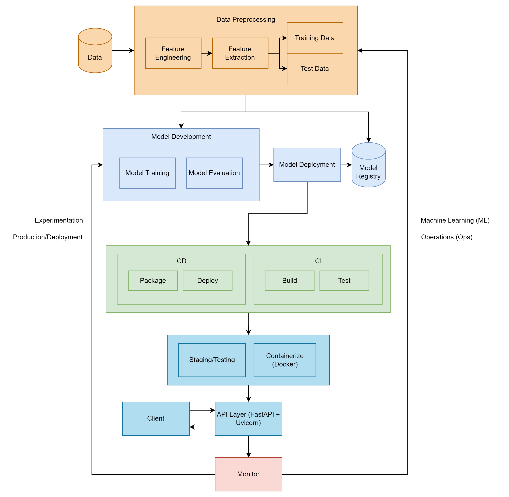

# Sales Forecasting Application

This application is designed to forecast sales based on promotion and other store-related factors for a retail environment. It utilizes machine learning to predict future sales and helps in planning stock levels and promotion strategies effectively.

## Description

The Sales Forecasting Application predicts the unit sales of products one week ahead, considering whether the items are on promotion. The solution leverages a Random Forest Regression model trained on historical sales data from 2016 and 2017, including features like store count, shelf capacity, and whether an item was promoted.

## Prerequisites

Before you begin, ensure you meet the following requirements:
- Python 3.8 or higher installed
- Pandas and Scikit-learn libraries installed
- Access to historical sales data in CSV format
- Docker Desktop

## Installation

To install the application, follow these steps:

```bash
git clone https://github.com/PieterES/sales-forecasting.git
cd sales-forecasting
pip install -r requirements.txt
```

## Application Structure
- /ah_package:
    - /training:
        - data_prep.py: Preprocessing of data to be used for fitting the model.
        - model_training.py: Script for training the machine learning model.
        - utils.py: Contains functions to be used such as saving, loading, fitting and evaluating the model.
    - inference.py: Script that uses the saved model to predict from a single list. For testing model without a server.
    - predict.py: Makes it easier for the user to use the API. 
- /data:
    - dataset.csv: The dataset used to train and evaluate the model.
- /dist:
    - ah_package-0.0.1-py3-none-any.whl: Python Wheel package for version 0.0.1
    - ah_package-0.0.1.tar.gz: Compressed archive of the ah_package for distribution and installation.
- /models
    - forecasting_model.pkl: The pretrained model that can be used to predict.
- /notebooks
    - original_notebook.ipynb: The original notebook used for dataprocessing and model training/evaluation.
    - original_readme.md: Original README with instructions for the assignment.
- /tests: Empty folder where the testing scripts would be.
- .pre-commit-config.yaml: Sets up a pre-commit hook with Ruff which automatically runs the Ruff linter each time changes are committed to ensure coding standards and quality are maintained.
- app.py: Create the app and the API server so the model can be used to predict.
- Dockerfile: Container configuration for deploying the API.
- .pre-commit-config.yaml: Configuration for pre-commit hooks to ensure code style.
- pyproject.toml: Specifying build system requirements, project metadata, and dependencies to streamline package building and distribution.
- README.md: Readme file containing instructions on how to use the solution for training the model and prediction
- requirements.txt: List of Python libraries required.

# Usage

## Training and saving model
To train and save the model, run:
```bash
python ah_package/training/model_training.py
```
The saved model will be under '/models/forecasting_model.pkl'

## Inference

To use the model in order to predict based on a single list of inputs run 
```bash
python ah_package/inference.py
```

The use will be given instructions:
```bash
Please enter the input data as a list:
[StoreCount, ShelfCapacity, PromoShelfCapacity, IsPromo, ItemNumber, CategoryCode, GroupCode, month, weekday, UnitSales_-7, UnitSales_-14, UnitSales_-21]
Example: [781, 12602.0, 4922.0, true, 8646, 7292, 5494, 11, 3, 6.190, 6.217, 6.075]
Enter your data here:
```

## Docker
To build the Docker Image run:
```bash
docker build -t myapp .
```
To start the API server, run:
```bash
docker run -d -p 8000:8000 myapp
```
To use the API server for prediction, run for example:
```bash
python ah_package/predict.py $PORT "$LIST"
```
Where PORT is the port to the API server, default is 8000 and LIST is a list for inputs, for example:

```bash
python ah_package/predict.py 8000 "[781, 12602.0, 4922.0, true, 8646, 7292, 5494, 11, 3, 6.190, 6.217, 6.075]"
```
Should give the result:
```bash
{"predicted_units":5761}
```
## Configuration Parameters
Model Parameters: Defined in model_training.py, adjustable based on performance metrics.

Current model parameters are:
```bash
    model = RandomForestRegressor(
        n_estimators=100,
        max_features=round(len(X_train.columns) / 3),
        max_depth=len(X_train.columns),
    )
```
Where len(X_train.columns) = 12


API Parameters: predict.py accepts a PORT and JSON list input with sales data features for prediction.
```bash
8000 "[781, 12602.0, 4922.0, true, 8646, 7292, 5494, 11, 3, 6.190, 6.217, 6.075]"
```

## Code Style

This project uses ruff for linting to ensure code style consistency. Set up the pre-commit hooks as described in .pre-commit-config.yaml.

## Architecture Diagram

Below is the architecture diagram for the application, illustrating the main components and describing how the solution would be deployed.


